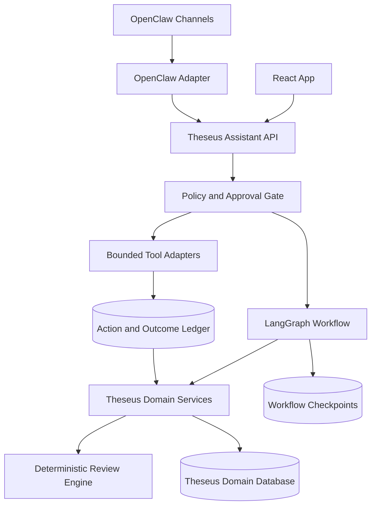

# Theseus Product and Agent Development Strategy

- Status: guiding document
- Baseline date: 2026-07-15
- Near-term checkpoint: midterm demo on 2026-07-18
- Product owners: Dong Zhang and Zhi Kang

## 1. Purpose and Authority

This document records the product direction agreed after the Sprint 5 UX and
architecture review. It connects the course MVP to a longer-term personal
assistant direction without expanding the current demo into an unsafe or
unverifiable autonomous-agent project.

Use it to decide what to build next, what to defer, and where new capabilities
belong. It is a strategy and delivery guide, not a replacement for executable
contracts.

When sources disagree, use this order:

1. `AGENTS.md` repository guidance.
2. Executable code and tests for current behavior.
3. `docs/03_data_model.md` and `docs/04_api_contract.md` for accepted contracts.
4. This document for product direction and phase gates.
5. Visual references for replaceable presentation style only.

Any implementation that changes persistence, API behavior, or cross-module
ownership still requires a focused issue, contract update, tests, and review.

## 2. North Star

Theseus should reduce the recurring cognitive work of planning and reviewing a
week while keeping the user in control of consequential decisions.

The intended loop is:

```text
Observe -> Explain -> Propose -> Approve -> Execute -> Verify -> Learn
```

The product promise is not "AI decides how the user should live." The promise
is:

- turn personal evidence into a small number of understandable signals;
- compress planning into a short approval and adjustment loop;
- support execution with low-noise reminders and bounded actions;
- preserve enough history to learn preferences and improve future proposals;
- keep evidence, provenance, consent, and reversibility visible.

Weekly evidence-backed review remains the product kernel. Conversation,
automation, and machine learning extend that kernel; they do not replace it.

## 3. Current Reality

As of 2026-07-15, Theseus is a working weekly-review MVP foundation rather than
a general life assistant.

| Capability | Current state | Direction |
|---|---|---|
| Stable review entities | Implemented in SQLite; schema v2 adds a local ownership root in the current worktree | Keep the core model stable while Signals and Plan consume it |
| Persistent review path | User-scoped sample data can flow through SQLite, the review engine, and stored review; v1 migration and restart behavior are tested locally | Rehearse the browser-to-API restart path |
| Review reasoning | Deterministic, evidence-first rules | Keep framework-independent |
| AI wording | Evidence-bound writer adapters exist | Keep AI wording downstream of computed facts |
| React app | Review, Track, and a simplified evidence-first Signals screen plus a Warm Stationery local-profile gate exist in the current worktree | Preserve Review/Track/Signals; make Plan a real adjustment surface |
| Personal identity | Local user create/list/select, retained selection, scoped API requests, and explicit sample-data status are implemented locally | Keep this separate from production authentication |
| Long-term preferences | Not represented | Add explicit, provenance-bearing preferences after user ownership |
| Agent orchestration | Not implemented | Pilot one LangGraph workflow after the domain foundation is stable |
| External execution | Not implemented | Add OpenClaw as an optional, policy-gated adapter later |

The current branch may contain work that has not reached `origin/main`.
Repository status and GitHub issues must be checked before every sprint plan;
documents must not describe local or unmerged work as released behavior.

## 4. Product Scope Boundaries

### Course MVP

Keep the course MVP focused on:

- local user creation and selection;
- goals, projects, weekly plans, time logs, reflections, and stored reviews;
- evidence-backed Signals;
- a realistic next-week adjustment in Plan;
- deterministic review plus optional supportive wording;
- sanitized sample scenarios and review-quality evaluation.

### Deferred from the course MVP

Do not put these on the 2026-07-18 critical path:

- production authentication;
- cloud sync or multi-device conflict resolution;
- automatic calendar rewriting;
- unrestricted shell, browser, email, or messaging actions;
- full OpenClaw integration;
- multi-agent orchestration;
- custom model training or reinforcement learning;
- mental-health diagnosis or claims about an objectively "best" life.

## 5. UX Direction

All screens follow the repository UX standard: structured first, decorative
second; one clear task per Level 1 screen; evidence reachable within two taps;
and visible loading, empty, error, success, and disabled states.

The Signals and Plan redesign is an information-architecture change, not an
art-direction replacement. Preserve the current Warm Stationery App identity:

- warm paper canvas and subtle paper/desk texture;
- the existing muted green, amber, blue, red, and neutral tokens;
- thin hand-drawn lines, low shadows, restrained borders, and line icons;
- the existing companion-character and illustration language when it
  communicates a real state;
- subtle fades and sheet movement rather than generic dashboard animation.

Reuse the current tokens and suitable assets before commissioning new artwork.
The updated screens must still feel like the same product as Review and Track;
they must not become a generic admin dashboard. Decoration may support the
hierarchy, but it may not be mistaken for evidence or computed severity.

| Screen | Level 1 question | Direction |
|---|---|---|
| Review | What mattered this week? | Preserve the current hierarchy and evidence expansion |
| Signals | Why did Theseus reach that conclusion? | Replace the decorative orbit with aligned, data-backed signal rows |
| Track | What am I doing now and what was recorded? | Preserve the timer/log focus and improve real-data states as needed |
| Plan | What should change next week? | Show capacity, planned load, slack, one proposal, and its effect |

### 5.1 Signals

Signals is interpreted evidence, not a decorative status dashboard and not a
duplicate of Track.

Level 1 should contain:

- one priority signal with severity expressed by text and color;
- one short reason using concrete evidence;
- four stable rows for Plan, Stage, Goal, and Energy;
- a clear distinction between API data, sample data, and no data.

Level 2 should contain the affected projects or records. Level 3 may contain
raw evidence details. Every summary signal must either open matching evidence
or explicitly say that evidence is unavailable.

Remove static red/amber/green orbit dots, arbitrary card rotation, and any
decoration that can be mistaken for a computed status. Do not use color as the
only state indicator.

A compact character, hand-drawn mark, or paper illustration may remain near
the priority signal when it communicates that signal's real state and does not
displace the reason or evidence.

### 5.2 Plan

Plan turns review feedback into a next-week adjustment. It is not a full
project-management or setup screen.

Level 1 should contain:

- real week dates;
- planned time, capacity, and slack in numbers and one compact visual;
- one evidence-linked proposal;
- a before/after change preview;
- Apply, Edit, and Undo states;
- a small number of labeled focus, maintenance, and slack rows.

Move Goal and Project creation into onboarding, Profile, or Setup. A Plan item
must reference a real project when applicable. Saving the same user and week
must follow a documented create/update rule instead of depending on fixture
dates or hard-coded project names.

Plan may retain a restrained hand-drawn balance or route motif, but it must be
driven by real planned/capacity/slack values and remain secondary to the
numbers and proposed change.

### 5.3 Trust and Accessibility

- Never silently present fixture data as live personal evidence.
- Every data-dependent surface needs loading, empty, error, and retry behavior.
- Every interactive icon needs an accessible name and keyboard-visible focus.
- Material changes need confirmation or a preview and should be reversible.
- Keep visible interface copy terse; put explanations in evidence/details.

## 6. Target Architecture



### 6.1 Component Responsibilities

| Component | Owns | Must not own |
|---|---|---|
| Theseus domain database and services | Users, goals, projects, plans, logs, reviews, preferences, provenance, approvals, actions, outcomes | Channel-specific session state |
| Deterministic review engine | Evidence calculation, risk rules, structured findings | HTTP routes, tool execution, provider sessions |
| LangGraph | Durable workflow state, pause/resume, approval checkpoints, retries | Canonical user records or duplicated review rules |
| OpenClaw | Conversation channels, scheduling, and bounded tool invocation through an adapter | A second source of truth, independent user policy, unrestricted writes |
| LLM providers | Wording, bounded classification, proposal generation from supplied context | Unverified facts or direct database mutation |

There must be one source of truth for user and domain data: Theseus. LangGraph
checkpoints and OpenClaw memory are supporting runtime stores, not replacements
for the domain database.

## 7. Local User and Persistent Ownership

The immediate persistence extension is a local profile, not production auth.

Minimum model direction:

- add a `users` table with a stable ID, display name, locale/time zone, and
  timestamps;
- associate all user-owned top-level records with `user_id`;
- reject cross-user references between goals, projects, plans, items, and logs;
- scope weekly-plan, daily-reflection, and weekly-review uniqueness by user;
- make every list, create, review-generation, import, and sample-load operation
  run under an explicit local user context;
- enable SQLite foreign keys for every connection;
- keep local databases, raw exports, and personal records out of Git.

The accepted local-user context mechanism is:

- `POST/GET /users` creates and discovers local profiles without requiring an
  existing profile;
- the frontend retains the selected integer ID in local browser storage;
- every persisted personal request sends `X-Theseus-User-Id`;
- the API validates that user, then binds repositories and domain services to
  that ID;
- request bodies cannot provide or override `user_id`;
- schema version 2 migrates version 1 records to a generated `Local User`
  profile so existing local work is not discarded.

This mechanism is documented in `docs/03_data_model.md` and
`docs/04_api_contract.md`. Endpoints may not silently read or return records
belonging to every user.

The demo proof is behavioral:

```text
Create user -> save user-owned records -> stop app -> restart app
-> select the same user -> regenerate review -> retrieve stored review
```

## 8. Long-Term Personalization and Memory

Long-term memory is not one vector database and is not synonymous with model
training. Store different kinds of knowledge separately.

| Memory layer | Examples | Storage rule |
|---|---|---|
| Explicit profile | Time zone, working hours, preferred slack | User editable; high trust |
| Domain facts | Goals, plans, logs, reflections, reviews | Structured source of truth |
| Episodic summaries | What happened in a week and what was tried | Evidence-linked and dated |
| Inferred preferences | Best reminder time, preferred task size | Confidence, source, scope, expiry, and correction required |
| Agent history | Proposal, approval, action, undo, result | Immutable audit trail where practical |
| Evaluation feedback | Accepted/rejected advice, usefulness, completion result | Used for ranking and evaluation |

Facts, user-stated preferences, and model inferences must remain distinguishable.
Every learned preference should carry provenance, confidence, evidence count,
last-confirmed time, and an expiry or review rule.

Personalization should optimize bounded outcomes such as suggestion usefulness,
plan adherence, protected slack, and restart success. Start with rules and
simple statistics. Introduce learned ranking only after the product records
enough proposal, decision, and outcome examples to evaluate it honestly.

## 9. Agent Workflow and Autonomy

The first LangGraph workflow should be narrow:

```text
Load user context
  -> compute deterministic weekly evidence
  -> draft one next-week adjustment
  -> show evidence and before/after diff
  -> wait for user approval or edit
  -> persist the approved plan change
  -> verify the stored result
  -> record outcome and feedback
```

Use an autonomy ladder:

| Level | Behavior | Release condition |
|---|---|---|
| 0 | Observe and explain | Evidence contract is complete |
| 1 | Suggest | Proposal is evidence-linked |
| 2 | Draft a reversible change | Diff and user edit are available |
| 3 | Execute a low-risk change after approval | Idempotency, audit, verification, and undo exist |
| 4 | Execute a bounded standing order | User-defined scope, expiry, rate limit, and kill switch exist |

Do not silently perform high-impact actions. Shell access, browser control,
external messages, financial actions, health decisions, destructive changes,
and broad calendar rewrites stay outside default authority.

## 10. Phased Roadmap and Gates

### Phase 0: Midterm Stabilization — 2026-07-15 to 2026-07-18

Goal: demonstrate one trustworthy local-user weekly-review loop.

Exit gate:

- a local user can be created and selected;
- user-owned records survive an application restart;
- the persisted-data-to-stored-review path passes;
- Signals does not show misleading static severity;
- Plan uses the selected week and real project data for the demo path;
- a repeatable demo script and sanitized fixture are available.

LangGraph and OpenClaw are explicitly excluded from this phase.

### Phase 1: Personal Data Foundation

Goal: make ownership, provenance, feedback, and reversible changes reliable.

Exit gate:

- all relevant repositories and API operations are user-scoped;
- migrations, export, and reset behavior are documented;
- preferences, proposals, approvals, actions, and outcomes have accepted
  contracts;
- fixture/live-data states are explicit in the UI.

### Phase 2: One LangGraph Planning Workflow

Goal: orchestrate weekly review to approved next-week adjustment without moving
domain truth out of Theseus.

Entry gate: Phase 1 contracts and policy rules are stable.

Exit gate: pause/resume, retry, approval, idempotency, verification, and audit
are covered by integration tests.

### Phase 3: OpenClaw Conversation Adapter

Goal: expose Theseus through one conversational channel.

Entry gate: the Theseus Assistant API has typed, bounded operations.

Rollout order: read-only context and review first; proposal second; approved
writes last. Keep OpenClaw behind an adapter so it can be replaced without
changing domain services.

### Phase 4: Learned Personalization

Goal: rank or time suggestions from recorded feedback and outcomes.

Entry gate: the system has enough representative observations to compare a
learned method against a simple baseline.

Exit gate: offline evaluation, user correction, confidence display, expiry,
and deletion are available. No vague claim of learning how a person "should"
live is acceptable.

### Phase 5: Bounded Proactive Execution

Goal: execute a small set of reversible, user-authorized standing orders.

Entry gate: policy, approval, sandbox, audit, rate limit, undo, and kill switch
have all been exercised. External integrations remain separate adapters.

## 11. Immediate Sprint 5 Replan

Sprint goal: by 2026-07-18, demonstrate that one local user can create and
retain personal weekly-review data, understand the most important signal, and
approve a realistic next-week adjustment.

### Task A: Lock the local-user contract

Implementation status: completed in the current worktree on 2026-07-15;
teammate review and merge status remain separate delivery checks.

- Owner: Dong Zhang
- Depends on: teacher feedback; current data model and API contract
- Files/modules: `docs/03_data_model.md`, `docs/04_api_contract.md`, schemas,
  SQLite schema, repository interfaces

Acceptance criteria:

- ownership and user-scoped uniqueness rules are documented;
- the local-user context mechanism is explicit;
- production auth and cloud sync remain deferred;
- cross-user references and unscoped list operations are rejected by design.

Verification: run the `api-contract-review` and `sqlite-persistence` review
checklists before implementation begins.

Demo evidence: an approved schema/API diagram and one local-user request flow.

### Task B: Implement the persisted local-user vertical slice

Implementation status: completed in the current worktree on 2026-07-15,
including schema-v1 migration and cross-user isolation coverage; full sprint
verification remains in Task F.

- Owner: Dong Zhang
- Depends on: Task A
- Files/modules: `backend/app/db/`, `backend/app/schemas.py`, `backend/app/api/`,
  `backend/app/services/`, persistence and integration tests

Acceptance criteria:

- create/list/select local user works;
- goals, projects, plans, logs, reflections, and reviews are user-scoped on the
  demonstrated path;
- data survives process restart;
- sample loading and review generation use the selected user;
- foreign keys and user-scoped uniqueness are tested.

Verification:

```bash
python3 -m pytest -q tests/test_schemas.py tests/db tests/api tests/services tests/integration
python3 -m compileall backend review_engine scripts
python3 scripts/run_sample_review.py
python3 scripts/load_sample_data.py --database /tmp/theseus-demo.db --user-name "Demo User"
python3 scripts/run_persisted_review.py --database /tmp/theseus-demo.db --user-id 1 --week-start 2026-06-08 --week-end 2026-06-14
```

Demo evidence: screen recording or live restart showing the same user's stored
records and stored weekly review.

### Task C: Connect local user context in the frontend

Implementation status: completed in the current worktree on 2026-07-15; the
production frontend build is verified and integrated demo rehearsal remains in
Tasks D-F.

- Owner: Zhi Kang
- Depends on: Task A and the accepted user endpoint contract; may use a typed
  mock while Task B implements the backend
- Files/modules: `frontend/app/src/App.tsx`, shared API adapters, a focused
  onboarding/Profile surface, shared state surfaces

Acceptance criteria:

- first run offers one short local-profile creation flow;
- an existing local user can be selected without production login UI;
- the selected user ID is retained as a client preference and included in
  every user-owned API operation;
- restart restores the same user context and reloads that user's data;
- API, sample, loading, empty, and error states cannot be mistaken for each
  other;
- the focused profile surface uses the existing Warm Stationery tokens and is
  keyboard and screen-reader operable.

Verification:

```bash
npm --prefix frontend/app test
npm --prefix frontend/app run build
```

Demo evidence: create a local profile on first run, restart the app, and show
the same selected profile and user-owned records.

Verification checkpoint (2026-07-15): the Issue #63 branch passes 91 Python
tests, 64 frontend tests, Python compilation, the frontend production build,
the deterministic sample review, a schema-v1 migration test, and a separate-
process sample -> SQLite -> review engine -> stored review run. This is a
current-worktree result, not a claim that teammate review or merge is complete.

Tasks D and E are complete in the current worktree. Next active task: Task F,
integration and rehearsal for the July 18 demo. Do not begin LangGraph or
OpenClaw work on this critical path.

### Task D: Simplify Signals

- Owner: Zhi Kang
- Depends on: stable signal view model and evidence mapping
- Files/modules: `frontend/app/src/features/signals/`, weekly-review mapping,
  shared state surfaces, global styles

Implementation checkpoint (2026-07-15): the decorative orbit and static dots
are removed; one evidence-ranked priority signal and stable Plan, Stage, Goal,
and Energy rows now drill into matching evidence and details. Canonical
`on_track`, stage-health, goal, no-data, and request-error paths are covered.
The complete frontend suite passes 46 tests across 11 files, and the production
build succeeds. Teammate review and merge remain separate delivery steps.

Acceptance criteria:

- static orbit severity decoration is removed;
- the Warm Stationery palette, paper texture, line treatment, and purposeful
  companion-art language remain visually consistent with Review and Track;
- Plan, Stage, Goal, and Energy summaries open matching evidence or an explicit
  no-evidence state;
- priority severity uses text as well as color;
- API, demo, loading, empty, and error states are distinguishable;
- desktop and mobile layouts remain readable and keyboard operable.

Verification:

```bash
npm --prefix frontend/app test
npm --prefix frontend/app run build
```

Demo evidence: screenshots and a click-through from the priority signal to its
project-level evidence.

### Task E: Make Plan a real adjustment surface

- Owner: Zhi Kang
- Depends on: Task A and a stable plan API response
- Files/modules: `frontend/app/src/features/plan/`, plan API adapter, shared
  state surfaces

Implementation checkpoint (2026-07-15): Plan now loads the selected user's
plans and projects, derives the target week from review or the next Monday,
shows a concrete project/load/slack diff, and atomically POSTs or PUTs the full
weekly plan. A new plan is deleted on Undo; an existing plan is restored by
replacement. Loading, saved, conflict/reload, error/retry, dismissed, and
restored states are explicit. Goal/Project CRUD and fixture values were removed
from the live surface while the Warm Stationery hierarchy was preserved.

Verification checkpoint: 91 Python tests and 64 frontend tests pass; Python
compilation, the frontend production build, deterministic sample review, and a
separate sample -> SQLite -> review engine -> stored review run also succeed.
This is a current-worktree result, not a claim of teammate review or merge.

Acceptance criteria:

- week dates, project, capacity, planned time, and slack come from current data;
- the Warm Stationery palette, paper texture, line treatment, and restrained
  illustration language remain visually consistent with Review and Track;
- fixture-specific project names and dates are removed from the live path;
- Goal/Project creation is not embedded in Plan Level 1;
- Apply shows a before/after diff and produces a consistent persisted plan;
- save success, conflict, error, retry, and Undo behavior are visible.

Verification:

```bash
npm --prefix frontend/app test
npm --prefix frontend/app run build
```

Demo evidence: review recommendation to Plan diff to approved saved plan.

### Task F: Integrate, review, and rehearse

- Owner: both
- Depends on: Tasks B, C, D, and E
- Files/modules: sanitized samples, demo script, evaluation notes, affected docs

Implementation checkpoint (2026-07-15): engineering-complete and tracked by
GitHub Issue #63. A secret-free
`prepare_midterm_demo.py` entry point now creates a fresh temporary SQLite
database, imports the sanitized user week, and stores local supportive wording.
A restart integration test covers the prepared profile, records, and review.
The four app tabs have sanitized mobile screenshots, with desktop composition
shots for Review and Plan, and a five-minute runbook now records preflight,
fallback, limitations, and the recording checklist. Scenario review exposed
and fixed one evidence inconsistency: unlinked planned items now count toward
total planned time and slack. Teammate review and merge, one live rehearsal,
and the actual fallback recording remain human delivery gates.

Acceptance criteria:

- the critical path works without an external model key;
- supportive wording failure falls back visibly to deterministic review;
- no personal database, credentials, or raw export is committed;
- known limitations are stated in the demo;
- the other teammate reviews schema, contract, and cross-screen changes when
  practical.

Verification:

```bash
python3 scripts/run_sample_review.py
python3 -m compileall backend review_engine scripts
python3 -m pytest -q
npm --prefix frontend/app test
npm --prefix frontend/app run build
git diff --check
```

Demo evidence: one rehearsed five-minute flow and a fallback recording.

## 12. Critical Path and Scope Rule

The Sprint 5 critical path is:

```text
Local-user contract -> persistence vertical slice -> frontend user context
-> Signals/Plan integration -> full verification -> demo rehearsal
```

If time is short, protect the persisted user/review path and truthful UI states.
Defer decorative polish, broad CRUD coverage in the demo, LangGraph, OpenClaw,
and machine learning. A smaller verified loop is better evidence than a larger
agent mock-up.

## 13. Decision Gates for Future Work

Do not introduce LangGraph until:

- the same workflow is understandable as explicit domain-service calls;
- user ownership and durable records are stable;
- a human approval checkpoint is genuinely required.

Do not enable OpenClaw writes until:

- operations use typed inputs and bounded permissions;
- approval, idempotency, audit, verification, and undo exist;
- high-risk tools are denied by default.

Do not introduce learned personalization until:

- proposal, decision, outcome, and correction data are stored;
- a simple rule/statistical baseline exists;
- the user can inspect, correct, expire, and delete learned preferences.

## 14. Success Measures

Near-term demo measures:

- persisted restart path succeeds;
- every visible signal has inspectable evidence;
- the user can explain the proposed plan change without developer narration;
- deterministic fallback works without external credentials.

Product measures for later phases:

- review factual accuracy;
- suggestion acceptance and user-rated usefulness;
- completion or restart success after an accepted suggestion;
- protected slack and reduced plan overload;
- correction rate for inferred preferences;
- unauthorized or unverifiable action count, which must remain zero.

## 15. Reference Material

Internal sources:

- `docs/02_system_architecture.md`
- `docs/03_data_model.md`
- `docs/04_api_contract.md`
- `docs/05_review_engine_design.md`
- `docs/07_product_backlog.md`
- `docs/11_architectural_runway.md`
- `docs/design/app-ux-spec.md`
- `docs/design/style-reference.md`

External implementation references:

- [LangGraph persistence](https://docs.langchain.com/oss/python/langgraph/persistence)
- [LangGraph memory](https://docs.langchain.com/oss/python/langgraph/add-memory)
- [OpenClaw architecture](https://docs.openclaw.ai/concepts/architecture)
- [OpenClaw memory](https://docs.openclaw.ai/concepts/memory)
- [OpenClaw tools](https://docs.openclaw.ai/tools)
- [OpenClaw security](https://docs.openclaw.ai/gateway/security)

External tools are fast-moving dependencies. Recheck their official
documentation when the corresponding phase begins and keep each integration
behind a replaceable adapter.
