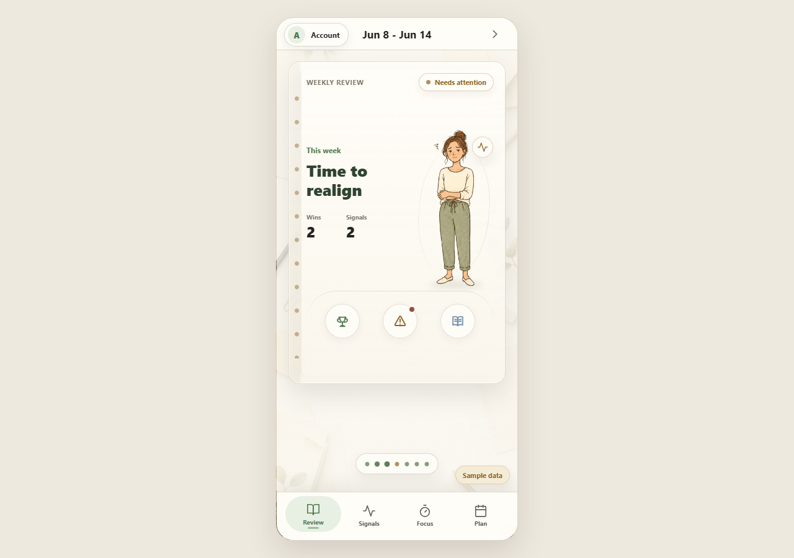
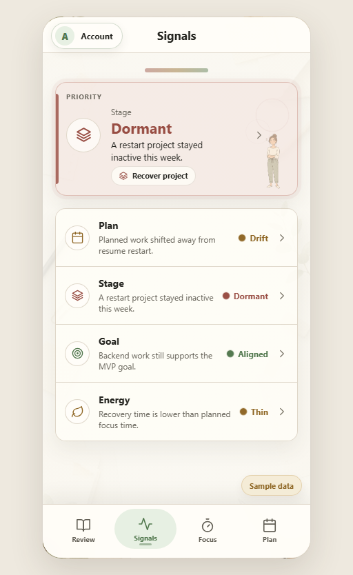
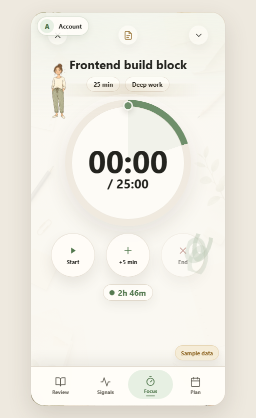
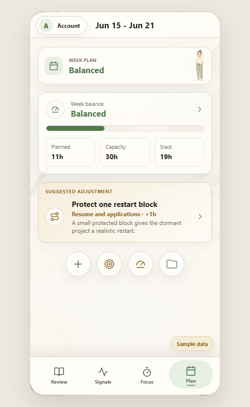
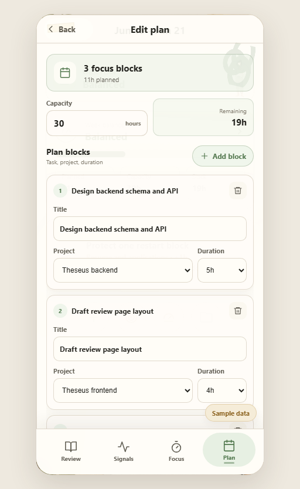

# Theseus Project Update

**Reporting date:** July 16, 2026  
**Project:** Theseus - Weekly AI Review for Goal-Time Alignment  
**Current checkpoint:** Midterm stabilization, before the July 18 integrated demo  
**Final course milestone:** August 1, 2026  

## 1. Executive Summary

Theseus has progressed from a rule-engine prototype into a working local-first weekly-review application. The current system can create and retain a local user profile, store user-scoped goals, projects, weekly plans, time logs, reflections, and weekly reviews in SQLite, calculate deterministic evidence, generate a supportive review, expose the most important signals, propose a next-week adjustment, and save or undo that adjustment.

The product loop currently demonstrated is:

```text
Select local profile
  -> load weekly evidence
  -> review wins and risks
  -> inspect a signal and its source
  -> adjust the next-week plan
  -> start a focus session
  -> save the session result
```

The merged `main` branch contains the persistence and evidence-first demo loop through PR #64 and the post-merge documentation update in commit `fc86ed9`. The current working tree also contains a substantial, not-yet-committed UI and interaction pass: revised profile/account screens, animated Review and detail pages, an immersive Focus timer and completion flow, simplified Plan editing, Plan-to-Focus handoff, and additional responsive layout fixes. This distinction matters: the screenshots in this report show the current local implementation, while the merged checkpoint remains the released baseline.

## 2. Current Implementation Status

### 2.1 Major milestones

| Milestone | Status | Current result |
|---|---|---|
| Repository and architecture foundation | Completed | Product requirements, architecture, data model, API contract, review-engine design, backlog, delivery plan, decision log, UX specifications, and demo runbook are documented. |
| Deterministic review engine | Completed | Framework-independent rules calculate goal alignment, plan drift, activity balance, dormancy, overload, slack, project-stage health, wins, risks, and next steps with evidence. |
| SQLite persistence | Completed | Schema v2 supports local-user ownership, foreign keys, timestamps, migrations from schema v1, repositories, and stored weekly reviews. |
| FastAPI service layer | Completed | Typed endpoints support users, goals, projects, weekly plans, time logs, mobile imports, deterministic analysis, and stored review generation. |
| Sample-to-review vertical slice | Completed | Sanitized sample data can be loaded into SQLite, analyzed by the review engine, and stored as a weekly review. |
| Local-profile ownership | Completed for MVP | Users can create, list, select, and retain a device-local profile. Personal API requests are scoped with `X-Theseus-User-Id`. This is not production authentication. |
| React application shell | Completed | Review, Signals, Focus, and Plan are available through a consistent bottom navigation and responsive mobile-first shell. |
| Evidence-first Review | Completed | The app presents a weekly status, wins, risks, full narrative, inspectable evidence, source trace, and direct Plan actions. |
| Actionable Signals | Completed | Plan, Stage, Goal, and Energy signals expose severity, reasons, project-level evidence, source trace, and concrete actions. |
| Focus workflow | Functionally implemented in current workspace | Task selection, recommendation explanation, completion standard, persistent running timer state, pause/resume, time extension, end-session handling, result classification, notes, celebration feedback, and time-log save are implemented. |
| Weekly Plan adjustment | Completed and further simplified locally | The merged flow supports planned/capacity/slack metrics, proposal preview, Apply, conflict handling, retry, Undo, and atomic plan replacement. The local pass adds direct editing and Plan-to-Focus handoff. |
| Supportive review writing | Completed as an optional layer | A deterministic local template, OpenAI adapter, and OpenCode Go adapter can rewrite computed findings without changing the evidence. |
| Mobile capture integration | Partially completed | A normalized mobile time-log import contract and backend endpoint exist. A complete synchronized mobile product remains deferred. |
| Evaluation and demo readiness | In progress | Sanitized scenarios, a review-quality rubric, scored samples, screenshots, preparation scripts, and a five-minute runbook exist. Live rehearsal and final recording remain human delivery tasks. |

### 2.2 Data model and persistence

The implementation is organized around stable domain entities rather than the original sample JSON shape:

- `LocalUser` owns all personal records on the local device.
- `Goal` represents a longer-term outcome.
- `Project` links execution to a goal and carries a stage and weekly target.
- `WeeklyPlan` and `PlannedItem` represent intended work and capacity.
- `TimeLog` preserves the raw activity name, normalized activity type, source, duration, project relationship, and note.
- `DailyReflection` stores optional contextual reflection.
- `WeeklyReview` stores structured findings, evidence, risk flags, recommendations, generated wording, and model metadata.

SQLite foreign-key enforcement is enabled for every connection. Repositories own SQL, while FastAPI routes only validate and orchestrate requests. Personal records are scoped to a selected local user, cross-user references are rejected, and schema-v1 data can be migrated into the local-user model instead of being discarded.

### 2.3 Backend and API functionality

The FastAPI backend currently provides:

- `POST/GET /users` and `GET /users/{user_id}` for local profiles.
- `POST/GET /goals` for goal records.
- `POST/GET /projects` for project records and stage information.
- `POST/GET /weekly-plans`, `PUT /weekly-plans/{id}`, and `DELETE /weekly-plans/{id}` for create, replacement, and Undo behavior.
- `POST/GET /time-logs` for focus and manual activity records.
- A mobile-import endpoint for normalized time-log batches.
- Weekly-review analysis and generation endpoints.
- A review service that loads persisted context, calls the framework-independent engine, optionally invokes a supportive writer, and stores the result.

The same normalized records can be supplied by sanitized sample data, web forms, and mobile export. This adapter-based approach keeps the review engine independent from the source of the evidence.

### 2.4 Review engine and AI wording

The deterministic engine is the source of truth. It currently supports:

- actual time by goal and project;
- planned-versus-actual comparison;
- zero-time active-goal detection;
- project dormancy and wake-up risk;
- stage-based minimum, target, and maximum checks;
- overloaded plans and insufficient slack;
- consuming, neutral, restore, and destroy activity summaries;
- evidence-backed wins, insights, risks, and no more than three next steps.

AI is deliberately downstream of these calculations. The local supportive template works without a provider key. Optional OpenAI and OpenCode Go adapters receive a structured evidence package and are used only to improve wording. Provider failure is explicit and can fall back to rule-based review rather than hiding the failure or inventing facts.

### 2.5 Local profile and account experience

The profile experience has been redesigned around a local-first model:

- Existing profiles are listed separately from profile creation.
- A new profile is created on a dedicated screen with required name and detected/editable time zone.
- The selected local profile is retained in browser storage and restored after restart.
- The interface explicitly labels device-local data.
- Account sync is presented as optional and separate from the local profile.
- Apple and Google controls are visible as planned but disabled capabilities.
- The email-code interaction is currently a local UI prototype, not a production identity provider.
- Future conflict choices are represented as `Sync this local profile`, `Use cloud profile`, `Keep both profiles`, and `Review and merge`; no cloud merge is executed yet.

This satisfies the MVP need for local ownership without misleading users into believing that cloud backup or production authentication already exists.

### 2.6 Review and evidence experience

The Review screen has been changed from a plain report into a compact weekly-review cover. It now uses a state-specific character, weekly status, counts of wins and signals, rhythm markers, and three clear entry points: Wins, Risks, and Full review.

Win detail pages show the affected outcome, planned and logged values, evidence by day, why the result matters, and a next action. Risk detail pages show severity in text and color, the reason, supporting metrics, an evidence trace, and a Plan action when the risk is actionable. Decorative elements use short entrance and idle animations, but evidence and actions remain visually primary.



**Figure 1. Current Review screen.** The weekly cover summarizes status, wins, and signals while keeping Wins, Risks, and Full review within one interaction. The `Sample data` badge makes the source explicit.

### 2.7 Signals experience

Signals is no longer a decorative health dashboard. It contains one evidence-ranked priority signal and four stable categories: Plan, Stage, Goal, and Energy. Each row communicates what happened, why it matters, and its text severity. Selecting a row opens matching project or evidence records, followed by a detailed source trace and a concrete action such as adjusting the plan or recovering a project.



**Figure 2. Current Signals screen.** A dormant project is identified as the priority signal, while Plan, Stage, Goal, and Energy remain comparable and directly inspectable.

### 2.8 Focus and session recording

The Focus screen has become an immersive execution surface rather than a static timer:

- The current task, recommended duration, work mode, recommendation reason, and completion standard are visible before starting.
- The timer can start, pause, resume, gain five minutes, and end early.
- Timer state is held above individual tab screens and calculated from elapsed time, so it continues when the user visits Review, Signals, or Plan.
- Plan items can be sent directly into Focus with the linked project and planned duration.
- Ending a session opens a completion page with a celebration state.
- The user classifies the result as completed, made progress, got stuck, or very draining, and may add a note.
- Saving writes the actual duration and linked activity/project through the time-log API when live persistence is available.



**Figure 3. Current Focus timer.** The selected task, target time, central progress ring, Start, time extension, End, and remaining recommended focus capacity are shown in one immersive view.

### 2.9 Plan and capacity experience

Plan connects review findings to a bounded, reversible next-week change. The main screen displays the target week, planned time, weekly capacity, available slack, one evidence-linked adjustment, and four compact detail actions.

The latest local simplification reduced plan entry to four concepts:

1. weekly capacity;
2. task or focus-block title;
3. linked project;
4. a preset duration.

Buffer remains an internal default rather than an additional form concept. Priority is derived from insertion order. The editor immediately displays planned and remaining time. Focus details summarize the week's blocks and start one directly; Slack explains whether the buffer is protected and links back to editing; Projects compares planned time with each project's weekly target.



**Figure 4. Current Plan overview.** The screen combines real target-week dates, load, capacity, slack, and one proposed restart adjustment without turning Plan into a full project-management dashboard.



**Figure 5. Simplified Plan editor.** Capacity, remaining time, task title, project, and duration are the only visible planning inputs. The editor supports adding and removing focus blocks and saving the complete plan.

### 2.10 UX system and motion

The current frontend uses a shared Warm Stationery visual system:

- muted green, amber, red, blue, and neutral semantic colors;
- paper texture, restrained borders, low shadows, and compact radii;
- shared line icons and icon-only navigation with accessible labels;
- full-screen detail pages for substantial Win, Risk, Focus, and completion workflows;
- sheets for shorter evidence and selection flows;
- consistent Back and Close behavior;
- labeled bottom navigation for Review, Signals, Focus, and Plan;
- responsive constraints and explicit overflow handling for long evidence and project names;
- short entrance, progress, character-idle, confetti, leaf, and completion animations.

Motion is used to communicate state changes, focus progress, and completion. It is not used as a substitute for evidence or status text.

## 3. Challenges and Issues Encountered

### 3.1 Controlling product scope

The largest product challenge was the tension between a broad productivity assistant and the course MVP. Account sync, calendar automation, wearable integration, learned recommendation ranking, and agent execution are attractive, but implementing them early would weaken the evidence-backed review loop. The solution was to keep weekly review as the product kernel and explicitly defer production authentication, cloud sync, and autonomous external actions.

### 3.2 Local profile versus real authentication

Early UI language risked mixing a device-local profile with an online account. The implementation now treats `LocalUser` as a persistence root and makes cloud account features optional and visibly unfinished. A remaining challenge is that the account-sync prototype must not be mistaken for a working Apple, Google, or email authentication service.

### 3.3 Data ownership and migration

Adding local-user ownership after initial persistence required schema-v2 migration, user-scoped uniqueness, foreign-key validation, repository changes, API context propagation, and cross-user isolation tests. This was more complex than merely adding a `user_id` column because every create, list, import, plan replacement, and review generation path had to respect the same owner.

### 3.4 Evidence trust and AI boundaries

Generated wording can sound authoritative even when the underlying data is incomplete. The project therefore separates deterministic findings from optional wording, preserves evidence and provenance, labels sample data, and exposes fallback states. This also required correcting an engine inconsistency where unlinked planned items were omitted from planned-time and slack totals.

### 3.5 Timer continuity and cross-screen state

The first timer implementation was owned by the Focus screen, so navigation could stop or reset it. The timer model was moved to persistent application state and elapsed time is derived from timestamps rather than only component ticks. This made cross-tab continuity and Plan-to-Focus handoff possible.

### 3.6 Responsive layout and navigation conflicts

Several UI passes exposed practical mobile issues: timer text was vertically misaligned, completion and Win pages could create horizontal scrolling, long evidence text exceeded card borders, and Back controls collided with the account control. These were addressed through stable grid tracks, `min-width: 0`, text wrapping, full-width detail panels, fixed header ownership, and responsive sizing. Continued device testing is still required before final release.

### 3.7 Plan complexity

The first direct Plan editor exposed capacity, buffer percentage, numeric minutes, project, title, and manual priority controls at once. Although technically complete, it required the user to understand implementation concepts. The latest iteration hides buffer configuration, derives priority automatically, uses duration presets, and presents remaining capacity immediately.

### 3.8 Development and test environment

The repository spans Python, Node, WSL, Windows-mounted storage, SQLite, and browser processes. Local Vite processes and browser caches occasionally served stale UI, so source verification and clean server restarts became part of the workflow. At this reporting point, the repository `.venv` does not contain `pytest`, so the previously merged Python baseline is documented but was not rerun during this report session.

## 4. Techniques, Tools, Frameworks, and Technologies Applied

### Backend and persistence

- **FastAPI** for typed HTTP endpoints and dependency-based local-user context.
- **Pydantic** schemas for request validation and response contracts.
- **SQLite** with foreign keys, migrations, repositories, transactions, and user-scoped uniqueness.
- **Repository and service patterns** to keep SQL out of routes and review rules out of FastAPI.
- **Adapter design** for sample import, mobile import, and optional review writers.

### Review and AI

- A **deterministic, framework-independent review engine** for testable evidence calculation.
- **Stage baselines** for startup, stable, sprint, dormant, and wake-up projects.
- **Evidence-bound prompt construction** so an LLM only rewrites supplied facts.
- A local supportive writer plus **OpenAI Responses** and **OpenCode Go** provider adapters.
- Explicit provider error and deterministic fallback behavior.

### Frontend

- **React 19** and **TypeScript** for component and domain-state implementation.
- **Vite** for local development and production builds.
- Feature-level models for Signals, Plan, and timer behavior rather than embedding all logic in components.
- Typed API adapters that map backend snake_case records into frontend domain models.
- Local browser preference storage for selected profiles, separated from canonical SQLite records.
- Accessible full-screen detail panels, sheets, icon controls, status states, and keyboard-operable navigation.
- CSS keyframe animation, conic progress rings, stable responsive grids, and restrained character motion.

### Testing and evaluation

- **Vitest**, **React Testing Library**, and **jsdom** for frontend models, API adapters, screens, and user flows.
- **pytest** for schemas, repositories, API routes, services, review rules, migrations, and integration paths in the merged baseline.
- Sanitized sample scenarios for aligned, drift, and overloaded weeks.
- A review-quality rubric covering factual accuracy, goal relevance, positive recognition, actionability, restraint, slack protection, and risk detection.
- **Headless Chrome and Chrome DevTools Protocol** for reproducible screenshots of the running application.

### Delivery practice

- Backlog stories, sprint gates, acceptance criteria, and verification commands.
- Focused API-contract and persistence reviews before cross-module changes.
- A repeatable midterm preparation script and five-minute runbook.
- Explicit separation between merged behavior, current local work, and future design proposals.

## 5. Verification Status

The merged July 15 checkpoint recorded:

- 91 Python tests passing;
- 64 frontend tests passing across 14 files;
- Python compilation passing;
- frontend production build passing;
- deterministic sample review passing;
- schema-v1 migration coverage;
- a separate-process sample -> SQLite -> review engine -> stored-review path passing.

The current frontend tree contains 68 declared tests. For the latest Plan/Focus pass, eight focused screen tests passed and the TypeScript production build completed successfully. `git diff --check` also passed. The current `.venv` lacks `pytest`, so the 91-test Python suite must be rerun after restoring the development dependencies before the next release claim.

## 6. Planned Tasks for the Next Stage

### Immediate: midterm stabilization

1. Commit the current UI and interaction pass in focused, reviewable changes.
2. Restore the Python development dependencies and rerun the complete Python and frontend suites.
3. Rehearse the five-minute profile -> Review -> Signals -> Plan -> Apply -> reload -> Undo flow.
4. Record and verify the fallback demo using sanitized data and no external model key.
5. Perform mobile-width checks for profile creation, Win/Risk details, Focus completion, and all Plan detail pages.
6. Confirm that session completion persists a time log and refreshes Review, Signals, Evidence, and weekly totals on the live API path.

### After the midterm

1. Complete plan-versus-actual metrics: estimated versus actual duration, planned versus executed sessions, deferrals, interruptions, and completion rate.
2. Add correction controls for Evidence: relink, exclude, merge duplicates, and add manual outcomes.
3. Close the Weekly Review loop with explicit next-week planning, keep/change focus decisions, and project pause/recovery actions.
4. Add weekly-capacity setup based on workdays, daily availability, rest days, and special events while retaining a simple default flow.
5. Add lightweight energy check-in and low-energy recommendations.
6. Persist recommendation acceptance, skip, delay, actual duration, and post-session energy as evaluation data.
7. Expand sanitized scenarios and collect classmate feedback against the quality rubric.
8. Define export, reset, proposal, approval, action, and outcome contracts before introducing any agent workflow.

### Deferred until later gates

- Production Apple, Google, or email authentication.
- Cloud backup, multi-device sync, and real conflict merging.
- Automatic calendar rewriting and wearable integration.
- LangGraph orchestration until ownership and approval contracts are stable.
- OpenClaw writes until typed operations, policy, audit, verification, and Undo exist.
- Learned personalization until enough proposal, decision, correction, and outcome data can support honest evaluation.

## 7. Timeline and Scope Changes

### Original timeline

- Proposal submitted: June 9, 2026.
- Progress Report 1: June 15, 2026.
- Midterm implementation checkpoint: July 18, 2026.
- Final defense and report: August 1, 2026.

The formal milestone dates have not changed. The July 18 engineering baseline was reached early enough to allow additional UI stabilization, but the current local enhancements still require commit review and full regression verification.

### Scope changes

| Original or early direction | Current decision | Reason |
|---|---|---|
| Broad productivity or life assistant | Evidence-backed weekly review remains the product kernel | A smaller verified loop is more defensible and evaluable. |
| Account registration as an early requirement | Device-local profiles are implemented; production auth is deferred | The MVP needs ownership and persistence, not cloud identity complexity. |
| AI-generated review as a central capability | Deterministic evidence is primary; AI only improves wording | This prevents unsupported findings and preserves offline demo reliability. |
| Mobile app and synchronization | Mobile import contract exists; full synchronization is deferred | Normalized capture can be tested without building a second persistence system. |
| Plan as a broad setup/project-management page | Plan is a bounded next-week adjustment and focus-block editor | This protects the review-to-action flow and reduces cognitive load. |
| Timer as a secondary input form | Focus became a richer execution and completion workflow | Actual session evidence improves the connection between planning and review. |
| Decorative dashboard Signals | Signals became an evidence-processing surface | Every visible status now needs a reason, source, and action. |
| Early agent framework adoption | LangGraph and OpenClaw moved behind explicit phase gates | Domain truth, user approval, reversibility, and audit must be stable first. |

The project has therefore expanded in interaction quality, local ownership, timer continuity, and reversible Plan behavior, while deliberately narrowing cloud, automation, and agent scope. This keeps the final course deliverable centered on a complete and trustworthy weekly-review loop rather than a collection of partially implemented integrations.

## 8. Overall Assessment

Theseus currently demonstrates a coherent technical and product foundation. Its strongest completed capability is not any single screen; it is the end-to-end chain from user-scoped evidence to an explainable review and a reversible plan adjustment. The main remaining risk is delivery discipline: the latest visual and interaction work must be committed in focused changes, the complete regression suite must be restored and rerun, and the live persisted demo must be rehearsed without relying on sample-mode visuals.

For the next checkpoint, success should be judged by whether a user can understand why a signal appeared, convert it into a realistic plan, run and record the work, and see that evidence reflected in the next review. Production authentication, cloud synchronization, and autonomous agents should remain secondary until that loop is consistently verified.
