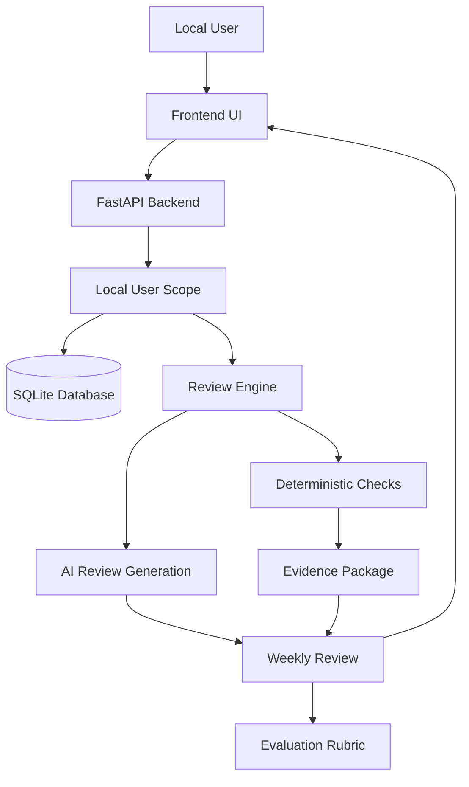
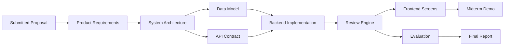
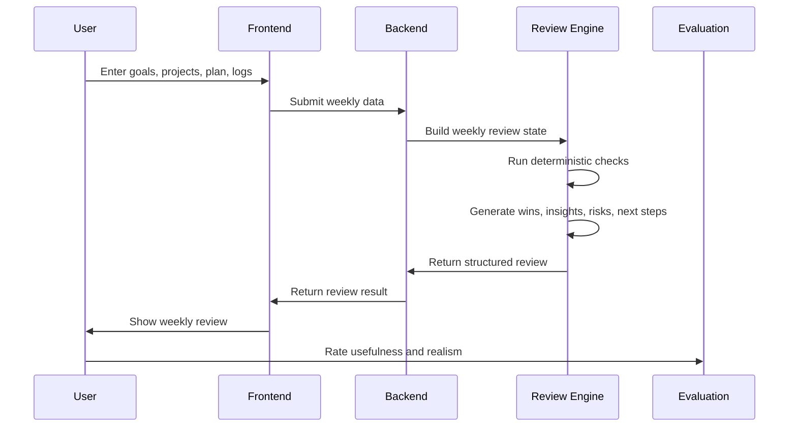

# Project Map

This page gives a quick visual overview of the Theseus repository, product modules, and current deliverables.

## 1. What Is in This Project Now

```text
theseus-weekly-review/
  README.md                         Project landing page and quick start
  docs/                             Product, architecture, Agile, and reporting docs
  backend/                          FastAPI API, SQLite repositories, and schemas
  review_engine/                    Rule-based weekly review analysis
  frontend/app/                     React review app and local-profile flow
  data/sample/                      Demo weekly dataset
  evaluation/                       Review quality rubric
  scripts/                          Local helper scripts
  .github/                          Issue and pull request templates
```

## 2. Product Module View



## 3. Development Layer View



## 4. Where to Look

| Need | File |
|---|---|
| One-page project summary | [README.md](../README.md) |
| Product scope and requirements | [01_product_requirements.md](01_product_requirements.md) |
| Architecture design | [02_system_architecture.md](02_system_architecture.md) |
| Database and entity design | [03_data_model.md](03_data_model.md) |
| Backend/API contract | [04_api_contract.md](04_api_contract.md) |
| Review logic design | [05_review_engine_design.md](05_review_engine_design.md) |
| Sprint plan | [06_agile_delivery_plan.md](06_agile_delivery_plan.md) |
| Backlog/user stories | [07_product_backlog.md](07_product_backlog.md) |
| June 15 progress report | [08_progress_report_1.md](08_progress_report_1.md) |
| Decisions and rationale | [09_decision_log.md](09_decision_log.md) |
| GitHub collaboration workflow | [10_github_workflow.md](10_github_workflow.md) |
| Sustainable architecture runway | [11_architectural_runway.md](11_architectural_runway.md) |
| Product and Agent development strategy | [13_product_agent_development_strategy.md](13_product_agent_development_strategy.md) |
| Mobile capture plan | [mobile_capture_plan.md](mobile_capture_plan.md) |

## 5. MVP Execution Flow



## 6. Recommended Documentation Strategy

Use repository Markdown as the source of truth during development:

- Versioned with code.
- Reviewed through pull requests.
- Easy to link from GitHub issues.
- GitHub renders Mermaid diagrams directly.

GitHub Wiki can be added later as a polished presentation layer after the project structure stabilizes. It should not replace `docs/` during active development.
