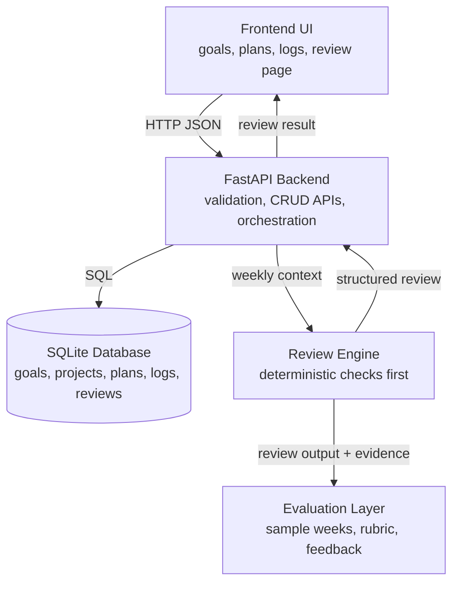
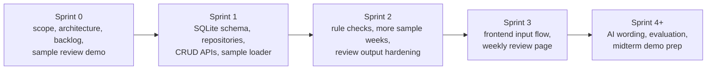
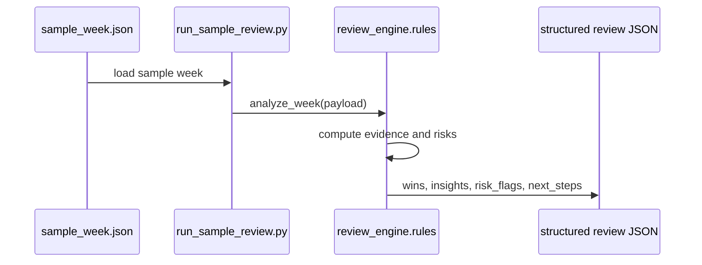

# Progress Report 1 Visual Assets

These visuals are source material for issue #14. They are also embedded in `slides/progress_report_1.html`.

## 1. Architecture Visual

Use this visual to explain how Theseus keeps evidence, analysis, storage, and presentation separate.

Presentation message:

- Frontend collects and displays data.
- Backend validates, persists, and orchestrates.
- SQLite stores stable MVP entities.
- Review engine calculates evidence before advice.
- Evaluation checks quality and usefulness.

## 2. Roadmap Visual

Use this visual to show that Progress Report 1 is between Sprint 0 and Sprint 1.

Presentation message:

- Sprint 0 is complete.
- Sprint 1 starts backend persistence.
- Do not claim SQLite persistence or CRUD APIs are already complete.
- The current demo proves the review logic with sample data.

## 3. Demo Flow Visual

Use this as the technical demo transition.

Presentation message:

- Current path is local and repeatable.
- It does not yet write to SQLite.
- Sprint 1 will persist the same data and store generated reviews.
